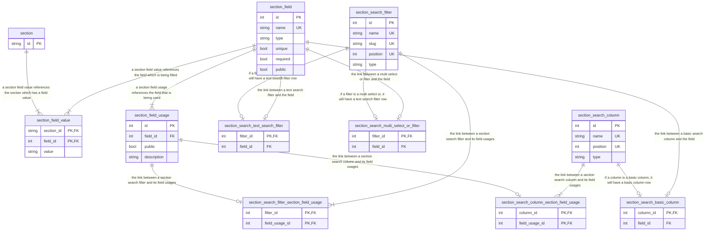

# classmap

Classmap is a generalized software solution for displaying course information, degree progress, and section enrollment eligability to students. The goal is to provide a one-stop-shop solutions for a student's academic advising needs. It works by collecting course section information, student degree information and combining the two into a dashboard which allows students to search through course offerings, figure out what classes they are eligible for and not eligible for, and get a high level overview of their progress towards getting their degree.

The system, as its currently envisioned, is entirely customizable. It is not SHU specific, so it can be ported to any high ed institute. This is subject to change based on time constraints. It's faster to write a SHU specific mini application that it is to create a generalized higher ed advising system.

Assuming the all of the configuration features are implemented, a higher ed institution will be able to configure a course section search based on their own needs, upload course sections, configure a student record, upload students, and upload / enter section enrollment criteria to communicate to students what exactly they need to achieve in order to be eligable for a given section.

## Student flow
The following is a super basic flow chart describing how a student will use the system. It's not much, from the students' point of view, this is a small application.

## Data Pipeline
The following is a rough depiction of how data will enter this system. Essentially this is a one way load, with the occassional manual cleaning of data (some data comes in unstructured, so it is structured in classmap)

## Database Diagram / Data Storage (WIP)

## Plan B

If this somehow doesn't work, I can always pivot to a version of this application which only uses public data. This is highly unlikely though.

## Milestones

### Phase 1 (Basic course search) (Done within 2-3 weeks)
For the next two weeks, I will have:
* Create code / database structure for configuring section data storage (what fields exist on a section, how do they behave)
* Load / enter section data storage configuration
* Load class sections into database
* Create code / database structure for configurable filtering/searching page for sections
* Load/enter section filtering/searching page configuration
* Create UI for section search page
* initial deployment of system!!!

### Phase 2 (student login and basic data)
* Create code / database structure for configuring student data (what fields exist on a student)
* Load / enter student data storage configuration
* Load / enter student data
* Setup SSO/login so students can login to system and be matched against a student record in the system
* Create UI for viewing student data
* Deploy newer version!!!

### Phase 3 (student course data)
* Create code / database structure for configuring student course data storage (what fields exist on a student-course relationship)
* Load / enter student course data storage configuration
* Load / enter student course data
* Create UI for viewing student course data
* Deploy newer version!!!

### Phase 4 (student degree progress)
* Create code / database structure for storing student degree progress
* Load student degree progress
* Create UI for viewing student degree progress
* Deploy new version!!!

### Phase 5 (section enrollment criteria)
* Create code / database structure for storing section enrollment criteria
* Load / enter section enrollment criteria
* Create UI for showing courses which are eligable for or not eligable for
* Deploy new version!!!